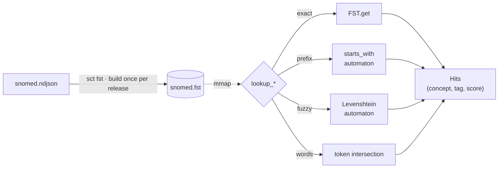

# SNOMED Local-First Tooling - Architecture Overview

## Overview

This project provides a layered, local-first toolchain for working with SNOMED CT clinical
terminology. The design follows a strict separation between:

1. A deterministic **build stage** that transforms RF2 release files into a canonical
   intermediate artefact
2. A set of independent **consumer tools** that express that artefact in different forms for
   different use cases

The philosophy is "convention over configuration" and "data over services". SNOMED CT is a
dataset. It should be possible to work with it like any other dataset - from the command line,
from a script, from an LLM tool, without running a server.

---

## Design Principles

- **Offline-first** - no network dependency at query time
- **Deterministic** - the same RF2 input always produces the same artefact
- **Single-file portability** - the core artefact is a single file you can copy, version, and share
- **Standard tooling** - queryable with `sqlite3`, `duckdb`, `ripgrep`, `jq` without any custom binary
- **Layered** - each layer is independently useful; you do not need the outer layers to use the inner ones
- **Composable** - commands should be *pluripotent*: small, single-purpose, and connectable over Unix pipes wherever it makes sense. Natural single-value readers accept `-` as an ordered stdin batch: identifier readers take the leading token of each non-comment line, query readers take each complete nonblank line, text and `--ids` output remain line-oriented, and JSON/YAML return one `{ "items": [{ "input": ..., "result": ... }] }` document. A batch resolves fully before stdout is written so failures cannot leave a partial machine result. Write-side commands accept newline-delimited SCTIDs on stdin through the same `-` convention. Human-readable chatter (counts, progress, warnings) goes to **stderr**, keeping stdout clean for pipes. A capability should exist as a reusable primitive first (e.g. `sct ecl expand`), with integrated conveniences (e.g. `sct codelist add --ecl`) layered on top of the same engine rather than hiding it. Prefer `producer | consumer` over a bespoke flag whenever the producer is independently useful - but keep an integrated form when it can capture *intent* a pipe cannot (provenance, an intensional rule).
- **LLM-native** - outputs are designed for direct consumption by language models and AI tooling

---

## The Onion Model

```
┌─────────────────────────────────────────────┐
│           MCP Server (Rust binary)          │  ← Layer 4: AI tool use
├─────────────────────────────────────────────┤
│     Vector Embeddings (Arrow IPC / Ollama)  │  ← Layer 3: semantic search
├─────────────────────────────────────────────┤
│      SQLite + FTS5  /  DuckDB Parquet       │  ← Layer 2: structured query
├─────────────────────────────────────────────┤
│         Canonical NDJSON artefact           │  ← Layer 1: the core artefact
├─────────────────────────────────────────────┤
│           RF2 Snapshot (input)              │  ← Source: SNOMED release
└─────────────────────────────────────────────┘
```

Each layer consumes the layer below it. The NDJSON artefact at Layer 1 is the stable interface
between the build stage and all consumer tools.

Two later additions sit alongside this model rather than inside it: an optional **FST lexical
index** (`sct fst`, built from the NDJSON) offers a mmap-able, typo-tolerant alternative to the
Layer 2 FTS5 search; and an **ECL engine** (`src/ecl/`) evaluates SNOMED Expression Constraint
Language queries against the Layer 2 SQLite database (powering `sct codelist add --ecl` and
`sct serve`). See [`spec/commands/fst.md`](commands/fst.md) and [`ecl.md`](ecl.md).

## Interactive GUI

`sct gui` is a native, read-only localhost adapter over the same SQLite and typed query engine. Its
product direction is a search-first **clinical knowledge atlas**: concept identity, hierarchy,
defining attributes, mappings, history, and release provenance in one progressively disclosed,
offline interface. It is distinct from the future WebAssembly browser demo and must make no
external runtime network requests. See [`gui.md`](gui.md) for the design, architecture,
Playwright feedback loop, accessibility criteria, and staged `GUI-*` build roadmap.

---

## Search internals

Layer 2 search has two backends: SQLite FTS5 (always present) and the optional FST lexical
index (`sct fst`). The FST is built once per release from the NDJSON artefact, then queried
read-only via a single mmap - no parsing or allocation on the query hot path:



The full diagram, byte-level container layout, and worked queries over real SNOMED terms
(`myocard` prefix, `asthsma` fuzzy match, `fracture femur` word intersection) are in
[`spec/commands/fst.md` §5.5-5.6](commands/fst.md#55-search-internals-diagram).

---

## Implementation notes

- All subcommands compile into a single `sct` binary (`cargo install sct`)
- `sct ndjson` is the critical-path component; correctness matters more than speed
- `sct sqlite`, `sct parquet`, `sct markdown` are streaming NDJSON consumers with progress bars
- `sct mcp` is read-only and stateless; opens SQLite on startup, serves until stdin EOF
- `sct embed` requires an external Ollama process; all other subcommands are fully offline
- All subcommands accept `--help`, produce useful errors, and exit cleanly
- The NDJSON artefact format is a public interface versioned with `schema_version`; see `src/schema.rs` for the current version and changelog.

---

## Documentation maintenance

`docs/walkthrough/` is the primary user-facing feature tour. It should be kept in sync
with the implementation. When making changes to this project, update the relevant walkthrough page
if any of the following change:

- A new command is added or an existing one is removed
- Command flags or behaviour change in a user-visible way
- Timing or performance figures change significantly
- A planned feature moves from roadmap to implemented (remove the *(planned)* tag)
- A new layer or output format is introduced

The walkthrough is also the source material for the Remotion demo - each top-level section
(prefixed `## N -`) corresponds to a demo scene. Keep section headings stable.

---

## UK-specific notes

The UK SNOMED CT Clinical Edition (available from NHS TRUD) includes:

- The SNOMED International release
- UK clinical extension
- dm+d (Dictionary of Medicines and Devices) drug extension

`sct ndjson` supports layering multiple RF2 snapshots via multiple `--rf2` flags to produce a
unified UK edition artefact. The `--locale en-GB` flag selects GB English preferred terms from
the UK language reference set.

## TODO

- static security analysis setup
